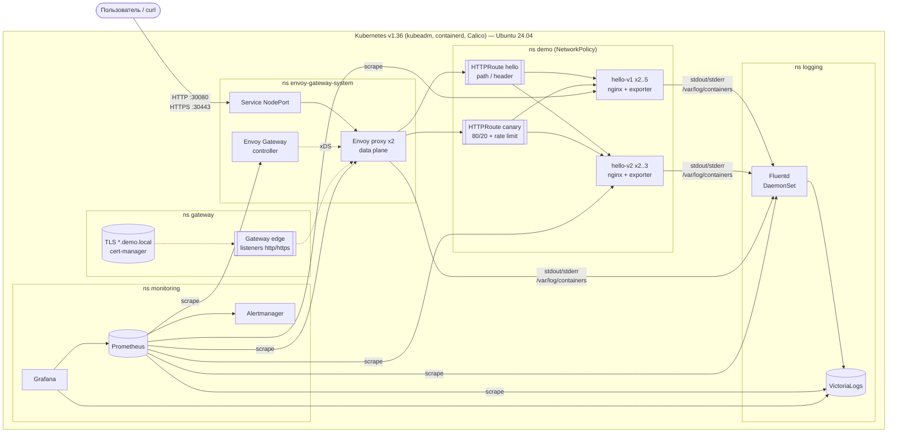

# MTS Engineer Hack — DevOps: Kubernetes + Gateway API + Prometheus + Fluentd

[](https://github.com/krantro2938/mts-devops-k8s/actions/workflows/ci.yaml)

Решение поднимает с нуля **Kubernetes-кластер на kubeadm** (Ubuntu 24.04), публикует в нём
веб-приложение (**nginx, «Hello World!»**) через **Kubernetes Gateway API** (реализация — **Envoy Gateway**),
собирает **метрики Prometheus** со всех слоёв (приложение, Gateway, кластер, логирование) и
**логи приложения через Fluentd** в хранилище **VictoriaLogs** с поиском и Web UI.

Всё разворачивается тремя командами (или одной — `make up`), повторный запуск безопасен,
результат проверяется автоматическими smoke-тестами. Тот же сценарий на каждом push выполняется
в **GitHub Actions на чистой ВМ Ubuntu 24.04** (настоящий `kubeadm init`, деплой, тесты, повторный деплой).

```bash
git clone https://github.com/krantro2938/mts-devops-k8s.git && cd mts-devops-k8s
sudo ./scripts/bootstrap-node.sh   # ОС + containerd + kubeadm init (кластер)
./scripts/deploy.sh                # все компоненты в кластере
./scripts/smoke-test.sh            # проверка: Gateway API, мониторинг, логирование
curl http://<IP-узла>:30080/       # -> Hello World!
```

---

## Содержание

1. [Архитектура](#1-архитектура)
2. [Технологии и версии](#2-технологии-и-версии)
3. [Требования к среде](#3-требования-к-среде)
4. [Развёртывание](#4-развёртывание)
5. [Проверка приложения и Gateway API](#5-проверка-приложения-и-gateway-api)
6. [Проверка мониторинга](#6-проверка-мониторинга-prometheus)
7. [Проверка логирования](#7-проверка-логирования-fluentd)
8. [Дополнительные возможности](#8-дополнительные-возможности)
9. [Структура репозитория](#9-структура-репозитория)
10. [Известные ограничения](#10-известные-ограничения)
11. [Удаление](#11-удаление)

---

## 1. Архитектура



**Поток запроса:** клиент → NodePort `30080/30443` → Envoy proxy (data plane, управляется Envoy Gateway) →
`Gateway edge` (listeners `http`/`https`) → `HTTPRoute` (выбор бэкенда по пути/заголовку/хосту/весу) →
`Service hello-v1|hello-v2` → pod nginx.

**Метрики:** Prometheus (Prometheus Operator) собирает через `PodMonitor`/`ServiceMonitor`:
nginx-exporter (sidecar приложения), Envoy proxy (HTTP-метрики по маршрутам: RPS, коды, latency),
контроллер Envoy Gateway, Fluentd, VictoriaLogs, cert-manager, Calico, node-exporter, kube-state-metrics,
kubelet/cAdvisor, apiserver, etcd, controller-manager, scheduler, kube-proxy, CoreDNS.

**Логи:** контейнеры пишут в stdout/stderr → kubelet/containerd кладут файлы в `/var/log/containers` →
**Fluentd DaemonSet** читает (CRI-парсер), склеивает разорванные строки, добавляет метаданные Kubernetes,
разбирает JSON access-лог nginx и Envoy на поля (`status`, `uri`, `request_id`, …), помечает access/error →
отправляет по HTTP (JSON lines) в **VictoriaLogs** → поиск через LogsQL API, Web UI и Grafana.

Принятые решения и их обоснование — в [docs/DECISIONS.md](docs/DECISIONS.md).

## 2. Технологии и версии

Все версии закреплены в одном файле [`versions.env`](versions.env).

| Компонент | Версия | Назначение | Способ установки |
|---|---|---|---|
| Ubuntu | **24.04 LTS** | ОС узла (протестировано) | — |
| **Kubernetes** (kubeadm, kubelet, kubectl) | **v1.36.5** | кластер | `scripts/bootstrap-node.sh` (apt `pkgs.k8s.io`) |
| containerd / runc | 2.2.9 / 1.4.3 | container runtime (systemd cgroup) | бинарники upstream + проверка sha256 |
| Calico (tigera-operator) | v3.33.0 | CNI + NetworkPolicy | Helm |
| local-path-provisioner | v0.0.37 | default StorageClass (PVC) | манифест (вендорен в репо) |
| metrics-server | 0.9.0 (chart 3.14.0) | `kubectl top`, HPA | Helm |
| **Gateway API CRDs** | **v1.6.1 (standard channel)** | API маршрутизации | Helm-chart `gateway-crds-helm` (server-side apply) |
| **Envoy Gateway** | **v1.9.2** (Envoy 1.39) | реализация Gateway API | Helm (OCI) |
| cert-manager | v1.21.2 | TLS-сертификат для HTTPS listener | Helm |
| kube-prometheus-stack | 91.8.2 (Prometheus Operator v0.94.1, Grafana 13) | Prometheus, Alertmanager, Grafana, экспортеры | Helm |
| **Fluentd** | **v1.19.3** (chart 0.6.0) | сбор логов (DaemonSet) | Helm |
| VictoriaLogs | v1.53.0 (chart 0.13.10) | хранилище логов + поиск + UI | Helm |
| nginx (`nginxinc/nginx-unprivileged`) | 1.30-alpine | демо-приложение | Helm-chart в репо `deploy/app/hello` |
| nginx-prometheus-exporter | 1.5.3 | метрики nginx (sidecar) | там же |
| Helm | v4.3.0 | установка чартов | `bootstrap-node.sh` |

### Gateway API

* **Реализация:** [Envoy Gateway](https://gateway.envoyproxy.io) **v1.9.2** (CNCF, open-source, conformance с Gateway API v1.6).
* **Используемые ресурсы Gateway API:** `GatewayClass` (`envoy`), `Gateway` (`gateway/edge`, listeners
  `http:80` и `https:443` c TLS Terminate), `HTTPRoute` (8 шт.), в т.ч. фильтры `URLRewrite`,
  `RequestRedirect`, `ResponseHeaderModifier`, `weight` бэкендов, `timeouts`, `allowedRoutes` с селектором namespace.
* **Расширения Envoy Gateway (Policy Attachment):** `EnvoyProxy` (NodePort, 2 реплики, PDB, JSON access-лог),
  `ClientTrafficPolicy` (X-Request-ID, TLS ≥ 1.2, таймауты), `BackendTrafficPolicy` (retry, circuit breaker,
  local rate limit), `SecurityPolicy` (Basic Auth для Prometheus/Alertmanager/VictoriaLogs).

## 3. Требования к среде

* **ОС:** Ubuntu **24.04** LTS (Server/Cloud image), x86_64 или arm64. Чистая ВМ или bare-metal.
* **Ресурсы:** рекомендуется **4 vCPU, 8 GB RAM, 30 GB диска** (минимум 2 vCPU / 4 GB — kubeadm требует ≥ 2 CPU).
* **Доступ:** пользователь с `sudo`, исходящий доступ в интернет (apt, GitHub releases, Docker Hub, registry.k8s.io, quay.io, Helm-репозитории).
* Нужные утилиты (`git`, `make`, `curl`) есть в Ubuntu по умолчанию; всё остальное (`kubeadm`, `kubectl`,
  `helm`, `containerd`, `jq`, …) ставит `bootstrap-node.sh`.
* Swap будет выключен скриптом (требование kubelet). Порты узла: `6443` (API), `30080`/`30443` (Gateway).
* Протестировано: **Ubuntu 24.04 LTS** — GitHub Actions runner `ubuntu-24.04` (4 vCPU, 16 GB), см. CI.

## 4. Развёртывание

### Вариант 1 — одной командой

```bash
git clone https://github.com/krantro2938/mts-devops-k8s.git
cd mts-devops-k8s
make up          # = make cluster (sudo) + make deploy + make test
```

### Вариант 2 — по шагам

```bash
# 1. Подготовка ОС и создание кластера (root): swap off, модули ядра, sysctl,
#    containerd+runc, kubeadm/kubelet/kubectl 1.36.5, helm, kubeadm init,
#    kubeconfig в ~/.kube/config текущего пользователя.
sudo ./scripts/bootstrap-node.sh

# 2. Компоненты в кластере (обычный пользователь), по порядку:
#    namespaces -> Calico -> StorageClass -> metrics-server -> kube-prometheus-stack ->
#    cert-manager -> Gateway API CRDs + Envoy Gateway -> Gateway -> VictoriaLogs + Fluentd -> приложение
./scripts/deploy.sh

# 3. Автоматическая проверка всего решения (42 проверки, ~2–3 мин)
./scripts/smoke-test.sh
```

Время развёртывания: ~10–15 минут (в основном загрузка образов).

Полезные цели `make`:

| Команда | Действие |
|---|---|
| `make status` | узлы, GatewayClass/Gateway/HTTPRoute, поды |
| `make creds` | логин/пароль администратора (Grafana, Basic Auth Prometheus/Alertmanager/VictoriaLogs) |
| `make urls` | строка для `/etc/hosts` и адреса UI |
| `make traffic` | 60 с смешанного трафика (200/404/500, v1/v2/canary) для дашбордов |
| `make lint` | статические проверки, как в CI |
| `./scripts/deploy.sh app` | выполнить отдельный шаг (`namespaces cni storage metrics-server monitoring cert-manager gateway-controller gateway logging app`) |

**Идемпотентность.** `bootstrap-node.sh` проверяет состояние перед каждым шагом (установленные версии,
наличие `/etc/kubernetes/admin.conf`) и не трогает существующий кластер; `deploy.sh` использует только
декларативные операции (`helm upgrade --install`, `kubectl apply --server-side`), секреты генерируются
один раз. CI запускает оба скрипта дважды и прогоняет smoke-тесты после каждого раза.

**Переменные окружения** (необязательно): `NODE_IP` — адрес узла, если авто-определение по маршруту по
умолчанию не подходит; `NODE_NAME`; `SKIP_OS_CHECK=1` — запуск не на Ubuntu 24.04 (не тестировалось).

**Дополнительные узлы (опционально):** на новом узле Ubuntu 24.04
`sudo ./scripts/bootstrap-node.sh worker "$(команда из 'kubeadm token create --print-join-command')"`.

## 5. Проверка приложения и Gateway API

`IP` — адрес узла (выводится в конце `deploy.sh`, либо `hostname -I | awk '{print $1}'`).

```bash
IP=$(kubectl get nodes -o jsonpath='{.items[0].status.addresses[?(@.type=="InternalIP")].address}')

# Основная проверка: запрос проходит через Gateway -> HTTPRoute -> Service -> nginx
curl -i http://$IP:30080/
# HTTP/1.1 200 OK
# x-served-by: envoy-gateway          <- добавлен фильтром HTTPRoute
# Hello World!
# version: v1
# pod: hello-v1-...

# Состояние ресурсов Gateway API
kubectl get gatewayclass,gateway -A          # envoy ACCEPTED=True, edge PROGRAMMED=True
kubectl get httproute -A
```

| Возможность | Команда | Ожидаемый результат |
|---|---|---|
| Маршрутизация по пути + URLRewrite | `curl http://$IP:30080/v2` | `version: v2` |
| Маршрутизация по заголовку | `curl -H 'X-Version: v2' http://$IP:30080/` | `version: v2` |
| Маршрутизация по hostname | `curl -H 'Host: v2.demo.local' http://$IP:30080/` | `version: v2` |
| Traffic splitting 80/20 (canary) | `for i in $(seq 20); do curl -s -H 'Host: canary.demo.local' http://$IP:30080/ \| grep version; sleep 0.2; done \| sort \| uniq -c` | ≈16 × v1, ≈4 × v2 |
| Rate limit (10 rps на canary) | `seq 60 \| xargs -P30 -I{} curl -s -o /dev/null -w '%{http_code}\n' -H 'Host: canary.demo.local' http://$IP:30080/ \| sort \| uniq -c` | есть `429` |
| HTTPS (TLS на Gateway, cert-manager) | `kubectl -n cert-manager get secret mts-demo-ca -o jsonpath='{.data.ca\.crt}' \| base64 -d > ca.crt`<br/>`curl --cacert ca.crt --resolve hello.demo.local:30443:$IP https://hello.demo.local:30443/` | `Hello World!`, сертификат валиден |
| Редирект HTTP→HTTPS | `curl -I -H 'Host: secure.demo.local' http://$IP:30080/` | `301`, `location: https://secure.demo.local:30443/` |
| Ошибки 404 / 500 | `curl -i http://$IP:30080/nope`, `curl -i http://$IP:30080/error` | `404`, `500` |
| Basic Auth на Prometheus | `curl -I -H 'Host: prometheus.demo.local' http://$IP:30080/` | `401` (с `-u admin:<пароль>` — `200/302`) |

Для доступа из браузера добавьте в `/etc/hosts` машины эксперта строку из `make urls`:
`<IP> hello.demo.local v2.demo.local canary.demo.local secure.demo.local grafana.demo.local prometheus.demo.local alertmanager.demo.local logs.demo.local`.

## 6. Проверка мониторинга (Prometheus)

Prometheus развёрнут Helm-чартом **kube-prometheus-stack** (Prometheus Operator); цели описаны
декларативно (`PodMonitor`/`ServiceMonitor`), правила — `PrometheusRule`.

**Какие метрики собираются**

| Источник (target) | Как подключён | Примеры метрик |
|---|---|---|
| Приложение nginx (sidecar nginx-prometheus-exporter) | `PodMonitor demo/hello` | `nginx_up`, `nginx_http_requests_total`, `nginx_connections_active` |
| Envoy proxy (Gateway data plane) | `PodMonitor envoy-gateway-system/envoy-proxy` | `envoy_cluster_upstream_rq_total`, `envoy_cluster_upstream_rq_xx{envoy_response_code_class}`, `envoy_cluster_upstream_rq{envoy_response_code}`, `envoy_cluster_upstream_rq_time_bucket` (latency), `envoy_http_downstream_rq_xx` |
| Envoy Gateway controller | `PodMonitor envoy-gateway` | `watchable_*`, `xds_*`, reconcile |
| Fluentd | `ServiceMonitor logging/fluentd` | `fluentd_input_status_num_records_total{namespace}`, `fluentd_output_status_emit_records`, `fluentd_output_status_num_errors`, `fluentd_output_status_buffer_queue_length` |
| VictoriaLogs | `ServiceMonitor` | `vl_rows_ingested_total`, `vl_data_size_bytes` |
| Кластер | kube-prometheus-stack | CPU/RAM подов (cAdvisor), node-exporter, kube-state-metrics, apiserver, etcd, scheduler, controller-manager, kube-proxy, CoreDNS, kubelet |
| Прочее | ServiceMonitor/PodMonitor | cert-manager, metrics-server, Calico Felix |

**Как проверить**

```bash
# 1) Сгенерировать немного трафика
make traffic            # или: for i in $(seq 50); do curl -s http://$IP:30080/ >/dev/null; done

# 2) Запрос к Prometheus через API-сервер Kubernetes (без port-forward и паролей)
q() { kubectl get --raw "/api/v1/namespaces/monitoring/services/kps-prometheus:9090/proxy/api/v1/query?query=$(jq -rn --arg q "$1" '$q|@uri')" | jq '.data.result'; }

q 'up{namespace="demo"}'                                                       # targets приложения = 1
q 'sum by (envoy_response_code_class) (rate(envoy_cluster_upstream_rq_xx{envoy_cluster_name=~"httproute/demo/.*"}[5m]))'   # RPS по классам кодов
q 'histogram_quantile(0.95, sum by (le) (rate(envoy_cluster_upstream_rq_time_bucket{envoy_cluster_name=~"httproute/demo/.*"}[5m])))'  # p95, мс
q 'sum(rate(nginx_http_requests_total{namespace="demo"}[5m]))'
q 'count by (job) (up == 1)'                                                    # все активные targets
q 'up == 0'                                                                     # пусто = все targets UP
```

**Web UI** (после записи в `/etc/hosts`, логин/пароль — `make creds`):

* Prometheus — `http://prometheus.demo.local:30080` → *Status → Targets* (все UP), вкладка *Graph* для запросов выше.
* Grafana — `http://grafana.demo.local:30080` → дашборд **MTS Demo → «MTS Demo - Gateway, App & Logs overview»**:
  RPS по кодам и маршрутам (видно разделение 80/20), p50/p95/p99 latency, 429, nginx, CPU/RAM подов, Fluentd, живые логи из VictoriaLogs.
  Плюс стандартные дашборды Kubernetes и Fluentd.
* Alertmanager — `http://alertmanager.demo.local:30080`. Правила: `HelloAppUnavailable`, `GatewayHigh5xxRatio`,
  `GatewayHighLatencyP95`, `EnvoyProxyDown`, `FluentdDown`, `FluentdOutputErrors`, `FluentdBufferBacklog`, `VictoriaLogsDown`
  + стандартные правила kube-prometheus-stack.

Без `/etc/hosts`: `kubectl -n monitoring port-forward svc/kps-prometheus 9090` → `http://localhost:9090`.

## 7. Проверка логирования (Fluentd)

**Какие логи собираются:** stdout/stderr всех контейнеров кластера (`/var/log/containers/*.log`), с
метаданными Kubernetes (`kubernetes.namespace_name`, `pod_name`, `container_name`, `labels`, `host`).
Для демо-приложения дополнительно:

* **access-лог nginx** — JSON в stdout, Fluentd раскладывает в поля: `log_type=access`, `status`, `method`,
  `uri`, `host`, `request_id`, `request_time`, `remote_addr`, `user_agent`, `app_version`, `pod`;
* **error-лог nginx** — stderr, `log_type=error` (например, `open() "…" failed` при 404);
* **access-лог Gateway (Envoy)** — JSON: `status`, `path`, `route`, `upstream`, `duration_ms`, `request_id`.

`X-Request-ID` проходит через Gateway (`ClientTrafficPolicy requestID: PreserveOrGenerate`) и пишется
и в лог Envoy, и в лог nginx — один запрос прослеживается сквозь оба уровня.

**Куда поступают:** Fluentd (DaemonSet, ns `logging`) → HTTP JSON-lines → **VictoriaLogs**
(`victorialogs.logging.svc:9428`, хранение 7 дней, PVC 5 Gi). Буфер Fluentd — на диске узла
(`/var/log/fluentd-buffers`), с бесконечными повторами: логи не теряются при недоступности хранилища.

**Как проверить**

```bash
ID=check-$RANDOM
curl -s -H "X-Request-ID: $ID" "http://$IP:30080/?probe=$ID"      # access-лог
curl -s "http://$IP:30080/missing-$ID" >/dev/null                # 404 -> error-лог
sleep 10

lq() { kubectl get --raw "/api/v1/namespaces/logging/services/victorialogs:9428/proxy/select/logsql/query?query=$(jq -rn --arg q "$1" '$q|@uri')"; }

lq "_time:10m kubernetes.namespace_name:demo \"$ID\"" | jq -c '{_time, log_type, status, uri, request_id, pod: .["kubernetes.pod_name"]}'
# {"_time":"…","log_type":"access","status":"200","uri":"/?probe=check-123","request_id":"check-123","pod":"hello-v1-…"}
# {"_time":"…","log_type":"error",…}  и  {"log_type":"access","status":"404",…}

lq "_time:10m kubernetes.namespace_name:envoy-gateway-system \"$ID\"" | jq -c '{_time, status, path, route, upstream}'   # тот же запрос в логе Gateway
lq '_time:1h kubernetes.namespace_name:demo log_type:error' | jq -c '{_time, _msg}'                                       # только ошибки
lq '_time:1h kubernetes.namespace_name:demo log_type:access | stats by (status) count()'                                  # статистика по кодам
```

**Web UI:** `http://logs.demo.local:30080` (VictoriaLogs vmui, Basic Auth — `make creds`), или Grafana →
*Explore* → источник **VictoriaLogs**, либо панель логов на демо-дашборде.
Без `/etc/hosts`: `kubectl -n logging port-forward svc/victorialogs 9428` → `http://localhost:9428/select/vmui/`.

Состояние самого Fluentd: `kubectl -n logging logs ds/fluentd`, метрики `fluentd_output_status_*` в Prometheus
и дашборд Fluentd в Grafana.

## 8. Дополнительные возможности

| Улучшение | Реализация | Проверка |
|---|---|---|
| **kubeadm** (приоритетный способ) + Ubuntu 24.04 | `scripts/bootstrap-node.sh`, конфиг `kubeadm/kubeadm-config.yaml.tpl` (v1beta4) | `kubectl get nodes -o wide` |
| **Расширенный Gateway API** | маршрутизация по пути, заголовку, hostname; URLRewrite; traffic splitting 80/20; HTTPS (TLS Terminate) с сертификатом cert-manager; редирект HTTP→HTTPS; ResponseHeaderModifier; таймауты; несколько backend; общий Gateway с `allowedRoutes` по label namespace (модель ролей platform/app) | раздел 5 |
| **Политики Envoy Gateway** | retry + circuit breaker, local rate limit (429), Basic Auth (SecurityPolicy), X-Request-ID, TLS ≥ 1.2 | раздел 5 |
| **CI/CD** (GitHub Actions) | `lint`: shellcheck, yamllint, helm lint, kubeconform по всем манифестам и отрендеренным чартам со схемами CRD; `e2e`: kubeadm на чистой Ubuntu 24.04 → deploy → smoke → повторный deploy → smoke, диагностика при сбое | вкладка Actions, `make lint` |
| **Автотесты** | `scripts/smoke-test.sh` — 42 проверки всех требований, ненулевой код при ошибке | `make test` |
| **Расширенный мониторинг** | HTTP-метрики Gateway (RPS, коды, latency p50/95/99), nginx, CPU/RAM, Fluentd; recording rules; 8 собственных алертов + Alertmanager; дашборд Grafana; все цели control plane kubeadm доступны (bind-address/metrics-адреса в конфиге kubeadm) | раздел 6 |
| **Централизованные логи с поиском** | Fluentd → VictoriaLogs (LogsQL, UI, Grafana); разбор JSON access-логов в поля; классификация access/error; логи Gateway; сквозной X-Request-ID; дисковый буфер | раздел 7 |
| **Надёжность** | по 2+ реплики приложения и Envoy, PDB, HPA (CPU), readiness/liveness, preStop, rolling update `maxUnavailable: 0`, retry на Gateway, лимиты ресурсов, systemReserved/eviction у kubelet, ротация логов контейнеров | `kubectl get hpa,pdb -A` |
| **Безопасность** | NetworkPolicy (default deny для приложения: вход только от Envoy и Prometheus, без egress); Pod Security Admission (`restricted` для demo/gateway/cert-manager); non-root, read-only rootfs, drop ALL capabilities, seccomp RuntimeDefault; случайный пароль администратора генерируется при деплое и хранится только в Secret; Basic Auth на UI без собственной аутентификации; проверка sha256 скачиваемых бинарников; версии всего закреплены | `kubectl -n demo get netpol`, `make creds` |
| **Воспроизводимость** | все версии в `versions.env`; Helm-чарты по точным версиям; без облачных/коммерческих сервисов | — |

## 9. Структура репозитория

```
├── Makefile                      # make up / deploy / test / creds / urls / lint ...
├── versions.env                  # ВСЕ версии компонентов
├── kubeadm/kubeadm-config.yaml.tpl   # InitConfiguration, ClusterConfiguration, KubeletConfiguration, KubeProxyConfiguration
├── scripts/
│   ├── bootstrap-node.sh         # Ubuntu 24.04 -> kubeadm-кластер (идемпотентно)
│   ├── deploy.sh                 # все компоненты в кластере (идемпотентно, по шагам)
│   ├── smoke-test.sh             # e2e-проверки
│   ├── generate-traffic.sh       # демо-трафик
│   ├── reset-node.sh             # kubeadm reset (удаление кластера)
│   └── common.sh
├── deploy/
│   ├── namespaces.yaml           # namespaces + Pod Security Admission
│   ├── cni/                      # Calico (values)
│   ├── storage/                  # local-path-provisioner (default StorageClass)
│   ├── metrics-server/
│   ├── cert-manager/             # values + private CA (ClusterIssuer)
│   ├── envoy-gateway/            # values контроллера
│   ├── gateway/                  # EnvoyProxy, GatewayClass, Gateway, Certificate, ClientTrafficPolicy
│   ├── app/hello/                # Helm-chart приложения: Deployments v1/v2, Services, HTTPRoutes,
│   │                             #   BackendTrafficPolicy, HPA, PDB, NetworkPolicy, PodMonitor, nginx ConfigMap
│   ├── monitoring/               # kube-prometheus-stack values, PodMonitors, PrometheusRule, дашборд, HTTPRoutes UI
│   └── logging/                  # Fluentd values (конфиг пайплайна), VictoriaLogs values, HTTPRoute UI
├── tests/                        # lint.sh (CI), crd2schema.py, gen-dashboard.py
├── docs/                         # DECISIONS.md, паспорт решения
└── .github/workflows/ci.yaml     # CI: lint + e2e на Ubuntu 24.04
```

## 10. Известные ограничения

* **Один control-plane узел** (не HA): etcd и API-сервер в одном экземпляре. Рабочие узлы добавляются
  `bootstrap-node.sh worker`, HA control plane потребует внешнего балансировщика для `controlPlaneEndpoint`.
* **Доступ через NodePort** `30080/30443` (нет облачного LoadBalancer). Для «настоящих» 80/443 нужен
  MetalLB/kube-vip или внешний балансировщик.
* **Хранилище local-path** — данные Prometheus/VictoriaLogs/Alertmanager лежат на диске узла
  (`/opt/local-path-provisioner`), не реплицируются. Хранение: метрики 3 дня, логи 7 дней.
* **TLS — собственный CA** (cert-manager self-signed) для домена `demo.local`; браузер покажет
  предупреждение, для curl используйте `--cacert ca.crt` (раздел 5) или `-k`. Для публичного домена
  достаточно заменить `ClusterIssuer` на ACME (Let's Encrypt).
* **metrics-server с `--kubelet-insecure-tls`** — kubelet в kubeadm использует самоподписанный serving-сертификат;
  для production — `serverTLSBootstrap: true` + автоматическое одобрение CSR.
* **Метрики control plane** — kubeadm-конфиг открывает metrics-порты scheduler/controller-manager (HTTPS с
  авторизацией) и etcd `:2381` (HTTP, только метрики) на всех интерфейсах узла; в production их стоит
  закрыть firewall'ом или оставить на localhost.
* **Prometheus/Alertmanager/VictoriaLogs без собственной аутентификации** — закрыты Basic Auth на Gateway;
  внутри кластера доступны без пароля (как и стандартно для этих компонентов).
* **Fluentd работает от root** (с `DAC_READ_SEARCH`, без прочих capabilities) — нужно для чтения
  `/var/log/pods` и файла позиций; namespace `logging` имеет PSA `privileged`.
* Проверено на **amd64**; arm64 поддержан скриптами (все образы multi-arch), но не тестировался.
* Требуется доступ в интернет при установке (образы и чарты не зеркалируются).

## 11. Удаление

```bash
sudo ./scripts/reset-node.sh        # kubeadm reset + очистка CNI/iptables (пакеты остаются)
```
